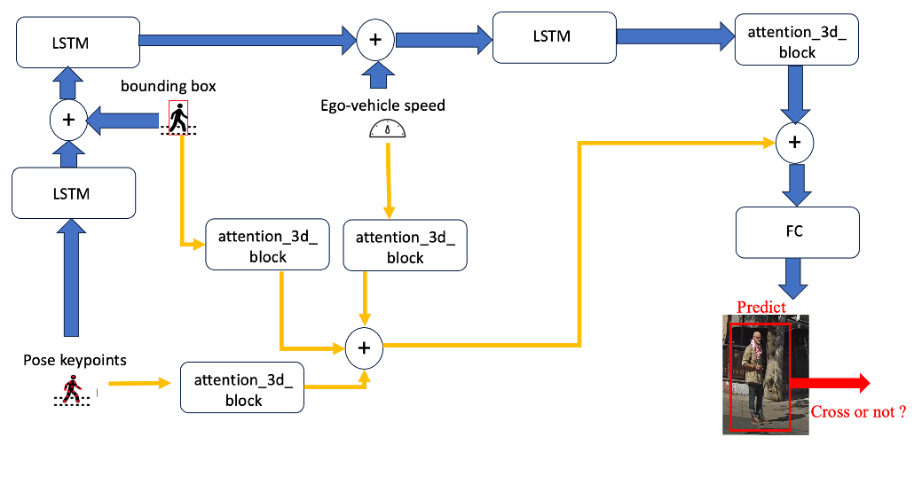

# A Lightweight LSTM-Attention Architecture and Experimental Evaluations with Real-World Datasets
  
## **Pedestrian Intent Prediction**  


**abstract**
Autonomous vehicles face significant challenges in understanding pedestrian behavior, particularly in urban environments. In such settings, the system must recognize pedestrian intentions and anticipate their actions to achieve safe and intelligent driving. This paper focuses on predicting pedestrian crossings, aiming to enable oncoming vehicles to react in a timely manner. We investigate the effectiveness of various input modalities for pedestrian crossing prediction, including human poses, bounding boxes, and ego vehicle speed features. We propose a novel  lightweight architecture based on LSTM and attention to accurately identify crossing pedestrians. Our methods are evaluated on two widely used public datasets for pedestrian behavior, PIE and JAAD datasets, and our algorithm achieves a state-of-the-art performance in both datasets.   



Our implementation relied on the pedestrian action prediction benchmark: `Kotseruba, Iuliia, Amir Rasouli, and John K. Tsotsos. "Benchmark for Evaluating Pedestrian Action Prediction." In Proceedings of the IEEE/CVF Winter Conference on Applications of Computer Vision, pp. 1258-1268, 2021.`


## Dataset Preparation  

Download the [JAAD Annotation](https://github.com/ykotseruba/JAAD) and put `JAAD` file to this project's root directory (as `./JAAD`).  

Download the [JAAD Dataset](http://data.nvision2.eecs.yorku.ca/JAAD_dataset/), and then put the video file `JAAD_clips` into `./JAAD` (as `./JAAD/JAAD_clips`).  

Copy `jaad_data.py` from the corresponding repositories into this project's root directory (as `./jaad_data.py`).  

In order to use the data, first, the video clips should be converted into images. This can be done using script `./JAAD/split_clips_to_frames.sh` following JAAD dataset's instruction.  

Above operation will create a folder called `images` and save the extracted images grouped by corresponding video ids in the `./JAAD/images `folder.  
```
./JAAD/images/video_0001/
				00000.png
				00001.png
				...
./JAAD/images/video_0002/
				00000.png
				00001.png
				...		
...
```
## Training and Test  


- JAAD dataset: 

```shell
# === run on JAAD datasets ===


python train_test.py -c config_files/Ours/PPCI_att_Jaad.yaml # PPCI_att


# ablation study
python train_test.py -c config_files/Ours/PPCI_att_Jaad_pose.yaml  # Features just pose
python train_test.py -c config_files/Ours/PPCI_att_Jaad_box.yaml  # Features just bound box
python train_test.py -c config_files/Ours/PPCI_att_Jaad_pose_box.yaml # Features just pose and bound box
python train_test.py -c config_files/Ours/PPCI_att_early_Jaad.yaml      # PPCI_att_early
python train_test.py -c config_files/Ours/PPCI_att_later_Jaad.yaml   # PPCI_att_later

```

- PIE dataset: 

```shell
# === run on PIE datasets ===


python train_test.py -c config_files_pie/Ours/PPCI_att.yaml  # PPCI_att


# ablation study
python train_test.py -c config_files/Ours/PPCI_att_pose.yaml  # Features just pose
python train_test.py -c config_files/Ours/PPCI_att_box.yaml  # Features just bound box
python train_test.py -c config_files/Ours/PPCI_att_pose_box.yaml # Features just pose and bound box
python train_test.py -c config_files/Ours/PPCI_att_early.yaml      # PPCI_att_early
python train_test.py -c config_files/Ours/PPCI_att_later.yaml   # PPCI_att_later

```


## POSES using HRNet:


The Poses can be downloaded here :

- on JAAD dataset: [Google Drive](https://drive.google.com/drive/folders/1EQZlxaCPXBCQuofSar1eWns0YyemsqDi?usp=drive_link) and put pose file to this project's root directory (as `./data/features/jaad/poses/`).  
- on PIE dataset: [Google Drive](https://drive.google.com/drive/folders/1_rSr3cOQYAj5ygWrTrVc6AF6_lYIQ6LA?usp=drive_link) and put pose file to this project's root directory (as `./data/features/pie/poses/`).  


